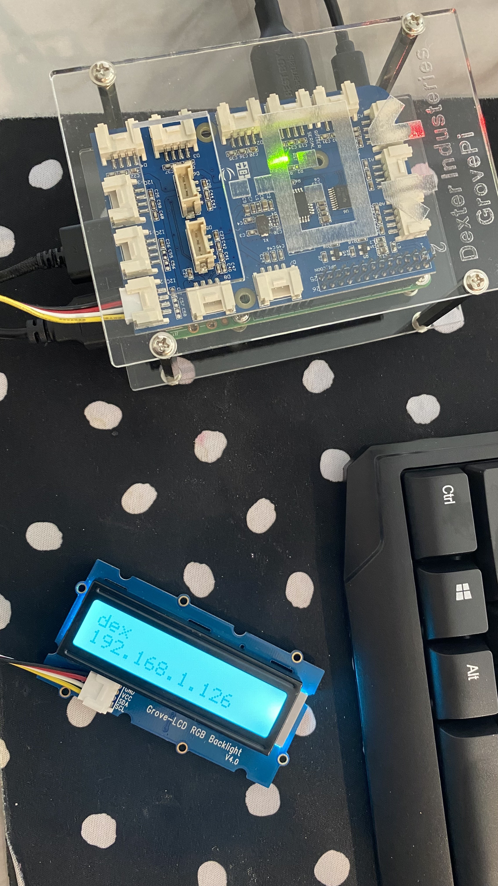
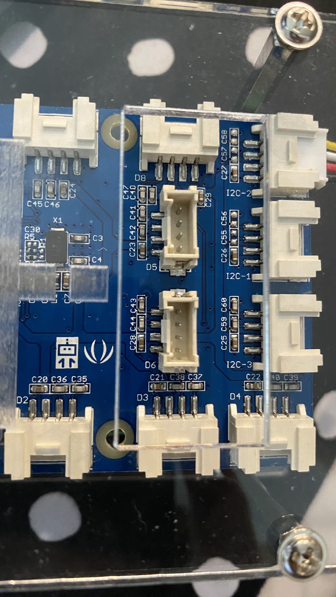
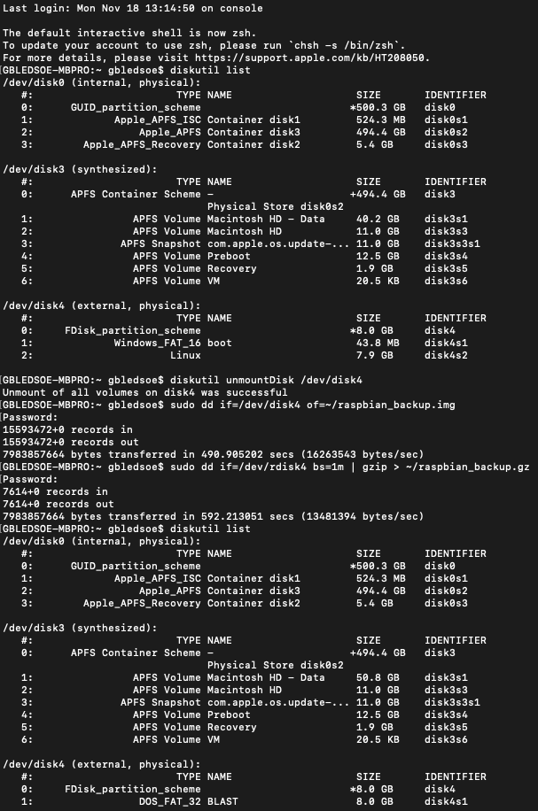
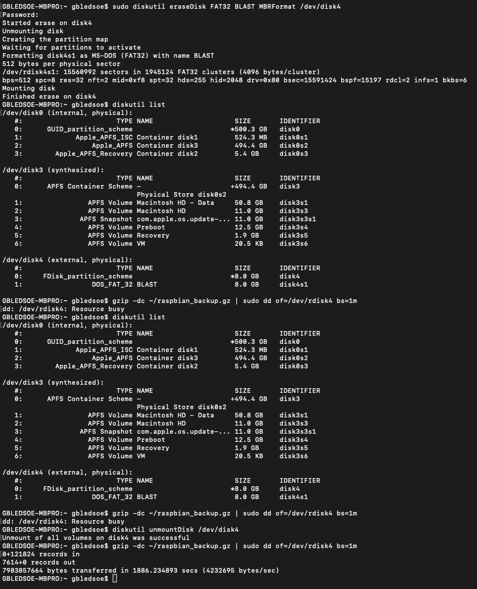

This blog will detail how to configure GrovePi devices to display their IP on a LCD screen at boot. This allows a user to connect to the GrovePi via SSH or software like [RealVNCViewer](https://www.realvnc.com/), eliminating the need for multiple peripherals (monitor, mouse, keyboard). You will need one set of peripherals to configure the first GrovePi, but this blog will also include instructions to copy that GrovePi data to another SD card.



A couple examples of how this is useful:
- Classrooms. Most students have their own personal device (Chromebook, Macbook, etc). This allows students to connect to a GrovePi and access all the benefits without needing to purchase and maintain peripherals.
- Home lab. It's convenient to just power on the GrovePi and use it for whatever you need via another machine.

## Assumptions

This blog assumes you have the following:
- Raspberry Pi 3 Model B. This would probably work for other versions.
- Grove [LCD RGB Backlight](https://wiki.seeedstudio.com/Grove-LCD_RGB_Backlight/).
- One set of peripherals (monitor, mouse, keyboard, HDMI cable, power cable for the pi).
- Basic knowledge of RaspberryPi, GrovePi, Linux, CLI, etc.

## Initial Setup

Install the necessary OS to the Pi. Depending on which Pi you're using and how you acquired it, you may already have a Dexter Industries SD Card which comes will all software pre-configured for your GrovePi.
Some resources that may help you:
- Resource from [Dexter Industries](https://www.dexterindustries.com/GrovePi/get-started-with-the-grovepi/setting-software/)
- Resource from [seeedstudio](https://files.seeedstudio.com/wiki/GrovePi_Plus/res/Setting_Up_Software_for_GrovePi.pdf)

Make sure the Pi is connected to the Internet with credentials for a Wi-Fi connection you will use for all the other Pis. For example, connect the Pi to the school's Wi-Fi with credentials that can be used on multiple devices at once.

## Installing Python Scripts and Software

Copy this [GitHub Repo](https://github.com/JamesWClark/Bash) using the command
```bash
git clone https://github.com/JamesWClark/Bash.git
```

Next, run the commands in the file `Bash/RaspberryPi/Dexter/2-Setup.sh` by either executing the file or running the commands manually.

If you run them manually, do them in this order:

Copy the startup script and enable printing of hostname and ip to Grove Pi LCD connected to I2C port.
If you get a `Permission Denied` from the first cp command, prefix it with `sudo`
```bash
cp ./grove-get-ip.py ~pi/
sudo cp ./print_ip /etc/init.d/print_ip
sudo chmod 755 /etc/init.d/print_ip
sudo update-rc.d print_ip defaults
```

Install VNC Server and VNC Viewer.
```bash
sudo apt-get -y install realvnc-vnc-server realvnc-vnc-viewer --fix-missing
```

Check the GrovePi Firmware.
```bash
cd ~pi/Desktop/GrovePi/Firmware
sudo ./firmware_update.sh
```

Make sure Python is installed.
```bash
cd ~pi/Desktop/GrovePi/Software/Python
sudo python setup.py install
```

If you do not have a keyboard or mouse connected to your Pi, VNC Server may not start automatically.
This is caused by the Pi not having enough entropy, thus preventing VNC Server and other services from starting.
To resolve this, you will need to install another entropy generator, for example:
https://help.realvnc.com/hc/en-us/articles/360021693151-VNC-Server-does-not-start-on-Raspberry-Pi-unless-a-mouse-keyboard-are-connected
```bash
sudo apt-get install -y haveged
```

Now, enable the VNC Server in the Pi advanced settings.
```bash
sudo raspi-config
```
Select `9 Advanced Options` then `A5 VNC` then _Enable the VNC Server_.

## Test the Pi

Connect the LCD screen to the I2C-2 port.


Reboot the Pi with the screen connected. At boot, the Python scripts will run and display the device's IP address on the LCD screen.
Connect to the Pi using the IP and software on another machine. I use [RealVNCViewer](https://www.realvnc.com/) on my Mac. An option for Windows is [tightVNC](https://www.tightvnc.com/).
```bash
Default creds:
username: pi
password: robots1234
```

Now that you have a functional GrovePi, you need to copy the microSD card to avoid having to set up each one individually!
> These commands are for a Mac. You may need different commands for other OS.
{: .prompt-info }

## Create a backup image of the SD card
1. Plug the microSD card into another machine.
2. Figure out which disk drive the microSD card is by running `diskutil list`. It will be the one that says `FDisk_partition_scheme`.
3. Unmount the disk so you can copy an image from it by running `diskutil unmountDisk /dev/diskn`
4. Create a copy on your local machine using the command `sudo dd if=/dev/rdiskn bs=1m | gzip > ~/raspbian_backup.gz`
- This command says "Using admin permissions, copy this disk drive (/dev/rdiskn) using block size 1m as a zipped folder using gzip and name it raspbian_backup.gz and save it in this current directory".
> Make sure to replace rdiskn with the actual disk number! My machine it was often rdisk4, but not always.
{: .prompt-info }
- `if` specifies the input file or device.
- `of` specifies the output file or device.
- `/dev/rdiskn` is used on the Mac and decreases the time to copy.
- `gzip` saves a substantial amount of space.
- `bs=1M` parameter also helps with the copy performance by specifying the block size.
- Alternatively, you could use the command `sudo dd if=/dev/diskn of=~/raspbian_backup.img bs=1m`
These commands are derived from [here](https://raspberrypi.stackexchange.com/questions/311/how-do-i-backup-my-raspberry-pi).

Here is what this looks like in the terminal:


## Copy the backup image to other SD cards
1. Plug the microSD card into your machine.
2. Figure out which disk drive the microSD card is by running `diskutil list`. It will be the one that says `FDisk_partition_scheme`.
3. Format the disk by running `sudo diskutil eraseDisk FAT32 NAMEOFSD MBRFormat /dev/diskn`
- You specify what you want the microSD card to be named.
- When you ran `diskutil list`, it may have said the disk is FAT16, you still want to use FAT32 in the command.
4. Unmount the disk so you can copy an image to it by running `diskutil unmountDisk /dev/diskn`
5. Copy the image to the microSD card. This will take a while.
- If you made the copy using gzip: `gzip -dc /path/to/backup.gz | sudo dd of=/dev/rdiskn bs=1m`
- If you used the alternate command: `sudo dd if=/path/to/backup.img of=/dev/rdiskn bs=1m`
- This copies a 8GB image. It should work for other sizes as well.

Here is what this looks like in the terminal:


## Credit
Huge thanks to J.W. Clark [LinkedIn](https://www.linkedin.com/in/thisclark/) for the code and guidance for the GrovePi setup.